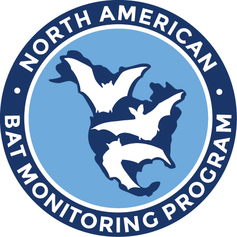

North American Bat Monitoring Program: R Data Connection Package <a href='https://nabatmonitoring.org/#/home'></a>
===

## Package Abstract

The North American Bat Monitoring Program: R Data Connection Package can be used to extract and upload data to the NABat Monitoring Program through the GQL API. This software is written as a wrapper around the NABat GQL API. Documentation for the database and API can be found at https://sciencebase.usgs.gov/. This code includes the ability to reformat NABat data, upload NABat data, create reports, find GRTS cells, and more (see vignettes in package). This code does not support modeling and analysis of data.

Vignettes and Examples can be used to better understand/utilize the functionality of the code. Users may access data or connect to projects that they have permissions to in the NABat Partner Portal ([NABat Website](https://sciencebase.usgs.gov/nabat/#/home)). Because permissions are defined NABat Partner Portal user accounts, users must have a partner portal account to interact with the NABat API. Accounts can be created via the Partner Portal.


## Installation

To install the toolbox in R run the following commands in a R terminal

```
# If you are on windows, be sure to install Rtools from 
##  https://cran.r-project.org/bin/windows/Rtools and follow 
##  install directions from there

install.packages(c('devtools','dplyr','flextable','ggplot2','htmltools','htmlwidgets',
  'httr','jsonlite','leaflet','lubridate','magrittr','maps','maptools','mapview','officer',
  'plotly','plyr','raster','rgdal','rmarkdown','sp','xml2', 'stringr'))

```

## Install from USGS software release (https://code.usgs.gov/fort/nabat/nabatr)
```
devtools::install_git("https://code.usgs.gov/fort/nabat/nabatr.git")

library(nabatr)
```
note: Refreshing R on windows: (Ctrl+Shift+F10)  Mac: (Cmd+Shift+Fn+F10)

## Install from provisional software (most up to date) (https://github.com/usgs/nabatr)
```
# Download Master branch and if it's been updated, reinstall latest version. build_vignettes
##  allows you to run the browseVignettes() function in the next cell. force will rebuild
##  the package if any new changes have been made
devtools::install_github('usgs/nabatr', build_vignettes = TRUE, upgrade = 'never', force = TRUE)

library(nabatr)
```


## See Vignettes for examples (run in RStudio) or See .Rmd files in Examples directory
```
# RStudio pop up in Help tab
??nabatr

# Web browser popup.  Click the HTML link for a vignette and
##  copy and paste the grey chunks of code into your R file.
##  Change any place holders in the code and Run.
browseVignettes('nabatr')

# If browseVignettes doesn't automatically open up a browser window,
##  you can use the following code to get access to the vignettes
##  if they were set TRUE on the install_github()
vignette(package = 'nabatr')

# Use the names from the above command (ex):
# # note: This will popup in your Help tab in Rstudio
vignette('get_sa_data')
```

If you are on windows and want to build the SA or MA report, be
sure to download phantomjs.  See below
```
webshot::install_phantomjs()
```

## Notes

The Examples and Vignettes directories are essentially mirrors of each other.  One is formatted into code blocks without {r} and the other
is formatted with {r}.  ex:  ```{r} code that runs in R (examples directory)``` and ``` code that does not run in R (vignettes directory) ``` 

If ever running any of the functions in branch = 'beta', be sure you are logged onto a USGS machine and on the VPN otherwise the code won't work.  
Use branch = 'beta' in the login and refresh token methods in order to use any get functions with branch = 'beta'.  


## Suggested Citation

Enns, K.D. and Talbert, C.B., 2021, North American Bat Monitoring Program: R Data Connection Package, Version 1.0.0: U.S. Geological Survey software release, https://doi.org/10.5066/P9LSLF93

## IPDS 
IP-120295